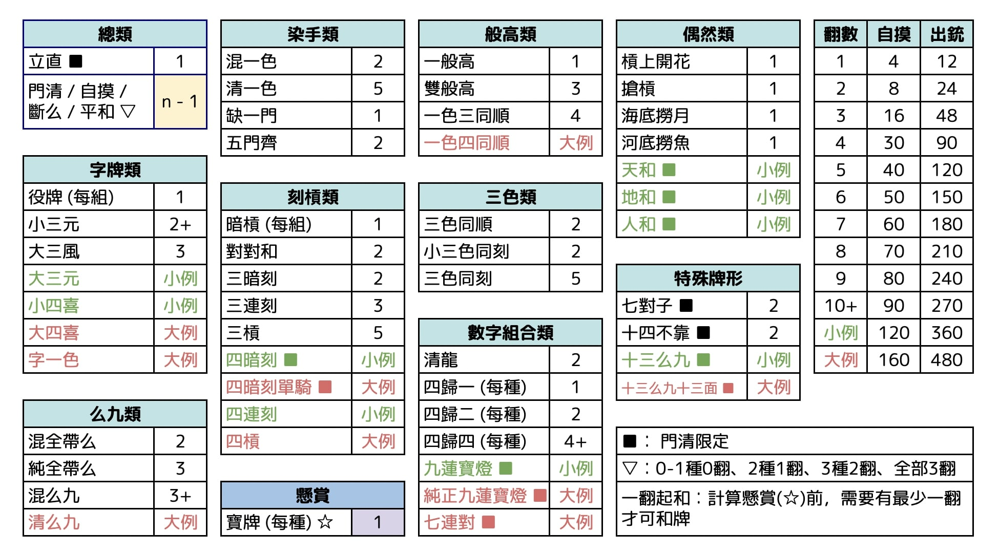

# 明將麻雀
基本上抄日本牌，但係加咗香港元素，就好似鹹魚軍艦咁。要帶個friend去打。希望冇明將壽司咁伏。

## 概要
-	四人麻雀，爭取排名為主，打東南圈 + 決勝局。每人250分開始，返點300
-	唔用花牌，一共136隻，王牌十四隻，尾十五隻係海底牌，尾七棟牌頂嗰隻係寶牌指示牌，冇槓赤寶
-	一翻起和。全統制。有一家負分，牌局就立即結束
-	牌河、鳴牌要好似日麻咁排好。振聽只振現物 / 同巡現物 (聽多扉的話，其他冇打過嘅扉冇呢個限制)
-	截和，無雙響。無本場分，無中途流局。莊家聽牌或者食和冧莊，否則過莊，不聽罰分為一共30分

## 和種列表

-	如果唔係門清狀態下和牌時，有最少一個役種為「鳴牌減翻」，整手牌要減一翻 (唔係每個役種減一翻)。「鳴牌減翻」嘅役種包括全順子型役種、染手役種、同全帶么役種
-	門清限定役種只有門清和出先有翻
-	達到和牌形時，扣除「鳴牌減翻」後同計算懸賞前，要有最少一翻先可以和牌

### 總類
-	立直︰1翻(門清限定)  
	門清聽牌時支付10分供託，之後唔可以轉章 (可以暗槓，唔可以送槓)。和出可以翻裏寶牌
-	門前清自摸和︰1翻(門清限定)  
	門清時聽牌，並自摸和了
-	斷么九︰1翻  
	手牌中冇么九或字牌
-	平和︰1翻(鳴牌減翻)  
	手牌有四個順子。可以鳴牌。聽牌牌型、雀頭冇限制
### 染手類
-	混一色︰3翻(鳴牌減翻)  
	手牌全部由筒索萬其中一種，加字牌組成
-	清一色︰6翻(鳴牌減翻)  
	手牌全部由筒索萬其中一種組成
-	缺一門︰1翻(鳴牌減翻)  
	手牌全部由筒索萬其中兩種組成
-	五門齊︰3翻(鳴牌減翻)  
	手牌有齊筒、索、萬、風牌、及三元牌。可複合七對子
### 刻槓類
-	暗槓︰1翻  
	手牌有一組暗槓，每組一翻。可複合三暗刻
-	對對和︰2翻  
	手牌有四個刻或槓﹐冇順子
-	三暗刻︰3翻  
	手牌有三個暗刻或暗槓
-	三連刻︰3翻  
	手牌有同花三個連續刻子
-	三槓子︰5翻  
	手牌有三個槓子
### 么九字牌類
-	役牌︰1翻  
	三元牌、門風、或圈風牌，每組一翻
-	小三元︰2翻(最少4翻)  
	有二個刻或槓嘅三元牌﹐再加上一對三元牌做眼。會再複計兩個三元刻子
-	大三風︰2翻  
	有三個風牌刻子
-	混全帶么︰2翻(鳴牌減翻)  
	每一組面子及眼均帶有么九或字牌
-	純全帶么︰3翻(鳴牌減翻)  
	每一組面子及眼均帶有么九數牌
-	混么九︰3翻 (最少5翻)  
	全由么九加上字牌組成。會再複計對對和
### 數字組合類
-	一般高︰1翻(鳴牌減翻)  
	手牌有兩組同花同數字嘅順子
-	雙般高︰3翻(鳴牌減翻)(最少4翻)  
	手牌有兩個一般高。必定複合平和
-	一色三同順︰4翻(鳴牌減翻)  
	手牌有三組同花同數字嘅順子
-	清龍︰2翻(鳴牌減翻)  
	其中一門有123, 456, 789三個順子
-	四歸一︰1翻  
	有四張相同嘅牌用喺一組刻子同順子
-	四歸二︰2翻  
	有四張相同嘅牌用喺一對眼同兩組順子
-	四歸四︰4翻(鳴牌減翻)(最少6翻)  
	有四張相同嘅牌用喺四組順子 (必定複合平和、缺一門 / 混一色 / 清一色、一般高 / 一色三同順)
### 三色類
-	三色同順︰3翻(鳴牌減翻)  
	手牌有筒索萬有同數字嘅順子
-	小三色同刻︰3翻  
	手牌有筒索萬其中兩門同數字嘅刻子或槓子，剩低一門有同數字做眼
-	三色同刻︰5翻  
	手牌有筒索萬同數字嘅刻子或槓子
### 偶然類
-	槓上開花︰1翻  
	補槓時食出。大明槓後和牌計食出銃
-	搶槓︰1翻  
	食其他人加槓嘅牌
-	海底撈月︰1翻  
	海底牌自摸
-	河底撈魚︰1翻  
	人地摸完海底牌後，食佢地打出嘅牌
### 七對子
-	七對子︰2翻(門清限定)  
	手牌由七對牌構成。可以有四隻一樣嘅牌，當做兩對

### 懸賞
*	寶牌指示牌同日麻唔同。如果指示牌係數牌X，咁寶牌就係同門嘅(10 - X)，例如當指示牌係8索，寶牌就會係2索；當指示牌係5筒，寶牌就會係5筒。字牌嘅寶牌示牌就同日麻一樣、冇槓寶牌 / 赤寶牌  
*	寶牌唔可以用嚟起和
*	立直和了後，可以翻開裏寶牌
*	同日麻唔同，寶牌最多計一翻，有多過一隻寶牌都只計一翻

### 小役滿
-	天和︰
	莊家配完牌就食出，暗槓之後就唔計。
-	地和​︰
	閒家配牌嘅13張已聽牌﹐食莊家打出嚟嗰隻牌，莊家暗槓咗就唔計。
-	人和︰
	閒家喺第一巡就食出，自摸或食出銃。之前有人上碰槓就唔計。
-	大三元︰
	有三個刻或槓嘅三元牌。
-	小四喜︰
    有三個刻或槓嘅風牌﹐再加上一對風牌做眼。
-	十三么九︰
	十三種么九字牌入面﹐其中一種有一對﹐另外十二種各一張。唔可以搶暗槓。
-	九蓮寶燈︰ 
	門前清清一色牌入面，有1112345678999，再加任何一隻。(1 / 9唔可以暗槓)。
-	四暗刻︰
	手牌有四個暗刻/暗槓。如果雙碰聽，必需要自摸；如果聽單騎，就可以食出銃。
-	四連刻︰
	同門四個連續嘅刻子

### 大役滿
-	大四喜︰
	有四個刻或槓嘅風牌。
-	字一色︰
	手牌全部由字牌組成。
-	清么九︰
    手牌全部由么九牌組成。
-	四槓子︰
	有四個槓
-	十三么九十三面聽︰
	十三種么九牌各有一隻，十三面聽牌。
-	四暗刻單騎︰
	有四個暗刻，和出的牌型為單騎。
-	純正九蓮寶燈︰
	手中有同門1112345678999，九面聽牌。
-	大車輪︰
	門清和牌，和出時有同門七對連續數牌。
-	一色四同順︰
	手牌有四組同花同數字嘅順子。

## 計分法
|翻數|基本分|3倍基本分|
|-|-|-|
|1|4|12|
|2|8|24|
|3|16|48|
|4|30|90|
|5|40|120|
|6|50|150|
|7|60|180|
|8|70|210|
|9|80|240|
|10+|90|270|
|小役滿|120|360|
|大役滿|160|480|

累計翻數夠10翻就叫爆棚，計10翻，再多啲翻都唔會再加上去。 

自摸時，每家畀基本分。出銃時畀三倍基本分。 

## 摸和
當四家不聽，或四家聽牌，無不聽罰分  
當一家聽牌，其餘每家畀10分  
當兩家聽牌，每家收取15分  
當三家聽牌，不聽嗰家向其他三家畀10分  
摸和過莊，不論莊家有冇聽牌

## 供託
食和嘅人可以攞哂啲供託。同日麻唔同，供託嘅來源有兩種，一係立直供託，二係流局供託。
立直嘅人要畀10分供託。流局時聽牌嘅每一家要畀3分供託。留意，呢個唔係本場積棒。

## 細則

### 振聽
如果食出銃嘅時候食嗰隻牌係自己打過，或者食同巡有人打過(同巡現物)，就會當食詐和。

並冇日麻嘅振聽咁嚴緊。如果聽多扉，冇打過嘅扉係唔會受限制，例如一家聽四七萬，佢打過四萬但冇打過七萬，咁佢係可以食人地七萬，並如常計翻。自摸不受限制。立直後嘅振聽都係只限制現物振聽。

### 食替
刻子唔可以食替，順子可以上完打另一隻，例如二三萬，上一萬打四萬係可以，但唔可以上一萬打一萬。

### 過水
過水只限食和，碰牌並冇限制，例如南家有一對東，西家打東南家唔碰，如果同巡北家打東，南家係可以碰，唔算過水。

### 詐和
如果有一家食詐和，每家統一賠90。

### 包牌
捨牌令其他人鳴牌並役滿確嘅一家要包牌，可包嘅役種有大三元、大四喜、四槓子、四連刻、及一色四同順。當役滿確定一家自摸和出，包牌者要幫其餘兩家支付分數。

### 上下役

清一色唔計混一色、純全帶么同混么九唔計混全帶么、雙般高同一色三同順唔計一般高。

## 決勝
參考RMU嘅新決勝方式嚟避象目無的問題。當南4局完結並落莊後，就會進入決勝局，由暫時第一位做莊

-	冇圈風，當局嘅莊係東家
-	牌局只有當(1)有人和牌並其分數在結算後為四家最高並不少於300分，或(2)有一家負分，就會結束。四家嘅分數就會係最終分數
-	和出者做莊，而非輪莊
-	如果摸和，下家做下一局嘅莊。

## 役種參考

