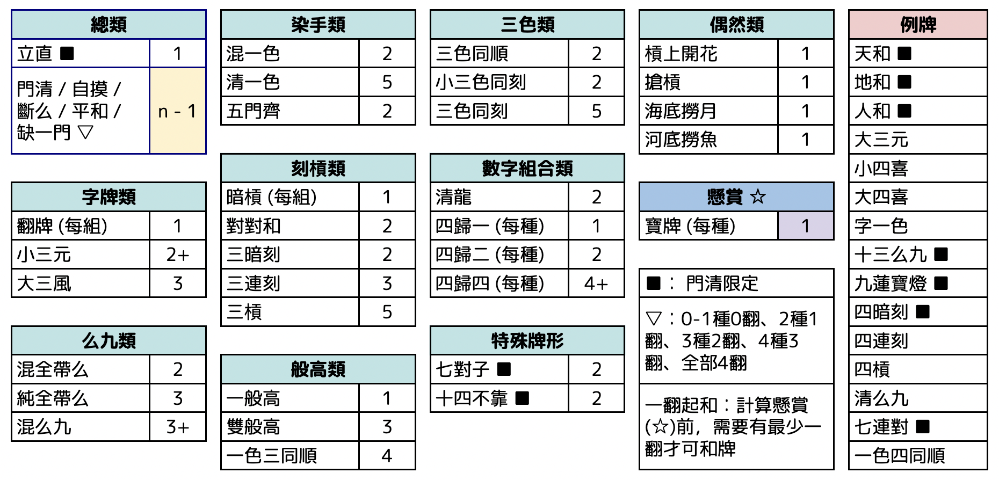

# 明將麻雀

## 概要
-	四人麻雀。一翻起和。最快得到13分或食出4個滿貫就贏。
-	唔用花牌，一共136隻，王牌十四隻，尾十五隻係海底牌，尾七棟牌頂起係寶牌指示牌，冇槓赤寶。
-	補槓係用海底牌補，王牌喺開完寶牌指示牌之後就唔會郁。
-	牌河、鳴牌要好似日麻咁排好。暗槓立即明示。
-	振聽只振現物／同巡現物 （聽多扉的話，其他冇打過嘅扉冇呢個限制）。
-	截和，無雙響。無中途流局。莊家食和冧莊，否則過莊。

## 和種列表

### 總類
-	立直︰1翻（門清限定）  
	門清聽牌宣佈聽牌，之後唔可以轉章。和出可以翻裏寶牌。  
	喺唔改變聽牌種類或送槓情況下，可以暗槓（可以改變牌姿或翻種）。  
	其他細則請參考立直麻雀。  
-	門摸斷平缺：0-1種0翻、2種1翻、3種2翻、3種4番、全部5種4翻。  
	-	門清：冇上／碰／明槓。
	-	自摸︰自摸和了。
	-	斷么九︰手牌中冇么九或字牌。
	-	平和︰手牌有四個順子。聽牌牌型、雀頭冇限制。
	-	缺一門：手牌全部由筒索萬其中兩種組成。
### 染手類
-	混一色︰2翻  
	手牌全部由筒索萬其中一種，加字牌組成。
-	清一色︰5翻  
	手牌全部由筒索萬其中一種組成。
-	五門齊︰2翻  
	手牌有齊筒、索、萬、風牌、及三元牌。可複合七對子，不複合十四不靠。
### 刻槓類  
-	暗槓︰每組1翻  
-	對對和︰2翻  
	手牌有四個刻或槓﹐冇順子。
-	三暗刻︰2翻  
	手牌有三個暗刻或暗槓。
-	三連刻︰3翻  
	手牌有同花三個連續刻子。
-	三槓︰5翻  
	手牌有三個槓子。  
### 字牌類
-	役牌︰每組1翻  
	三元牌、門風、或圈風牌，每組一翻。連風牌計2翻。  
-	小三元︰2翻（最少4翻）  
	有二個刻或槓嘅三元牌﹐再加上一對三元牌做眼。必定複合兩個三元刻子。
-	大三風︰3翻  
	有三個風牌刻子。
### 么九類
-	混全帶么︰2翻  
	每一組面子及眼均帶有么九或字牌。
-	純全帶么︰3翻  
	每一組面子及眼均帶有么九數牌。
-	混么九︰3翻（最少5翻）    
	全由么九加上字牌組成。必定複合七對子或對對和。
### 般高類
-	一般高︰1翻  
	手牌有兩組同花同數字嘅順子。
-	雙般高︰3翻  
	手牌有兩個一般高。不複合七對子。
-	一色三同順︰4翻  
	手牌有三組同花同數字嘅順子。
### 三色類
-	三色同順︰2翻  
	手牌有筒索萬有同數字嘅順子。
-	小三色同刻︰2翻  
	手牌有筒索萬其中兩門同數字嘅刻子或槓子，剩低一門有同數字做眼。
-	三色同刻︰5翻  
	手牌有筒索萬同數字嘅刻子或槓子。
### 數字組合類
-	清龍︰2翻  
	其中一門有123, 456, 789三個順子。
-	四歸一︰每種1翻  
	有四張相同嘅牌用喺一組刻子同順子。
-	四歸二︰每種2翻  
	有四張相同嘅牌用喺一對眼同兩組順子。
-	四歸四︰每種4翻（最少6翻）  
	有四張相同嘅牌用喺四組順子 （必定複合染手同順）。
### 偶然類
-	槓上開花︰1翻  
	補槓時食出。大明槓後和牌計食出銃。
-	搶槓︰1翻  
	食其他人加槓嘅牌。
-	海底撈月︰1翻  
	海底牌自摸。
-	河底撈魚︰1翻  
	人地摸完海底牌後，食佢地打出嘅牌。
### 特殊牌形
-	七對子︰2翻（門清限定）  
	手牌由七對牌構成。可以有四隻一樣嘅牌，當做兩對。可複合五門齊。
-	十四不靠︰2翻（門清限定）  
	手牌由單張3種花色147、258、369嘅數字牌及東南西北中發白中的任何14隻組成。不複合五門齊。
### 懸賞
懸賞唔可以用嚟起和
-	寶牌：每種1翻  
	*	寶牌指示牌同日麻唔同，寶牌指示牌就係寶牌。
	*	寶牌開尾七棟同尾六棟上面嗰隻。
	*	立直和了後，可以翻開一隻裏寶牌（尾七棟下面嗰隻）。
	*	同日麻唔同，每一隻指示牌最多計一翻。

### 例牌
-	天和︰
	莊家配完牌就食出，暗槓之後就唔計。
-	地和​︰
	閒家配牌嘅13張已聽牌﹐食莊家打出嚟嗰隻牌，莊家暗槓咗就唔計。
-	人和︰
	閒家喺第一巡就食出，自摸或食出銃。之前有人上碰槓就唔計。
-	大三元︰
	有三個刻或槓嘅三元牌。
-	小四喜︰
    有三個刻或槓嘅風牌﹐再加上一對風牌做眼。
-	大四喜︰
	有四個刻或槓嘅風牌。
-	字一色︰
	手牌全部由字牌組成。
-	十三么九︰
	十三種么九字牌入面﹐其中一種有一對﹐另外十二種各一張。唔可以搶暗槓。
-	九蓮寶燈︰ 
	門前清清一色牌入面，有1112345678999，再加任何一隻。（1／9唔可以暗槓）。
-	四暗刻︰
	手牌有四個暗刻／暗槓。
-	四連刻︰
	同門四個連續嘅刻子。
-	四槓︰
	有四個槓。
-	清么九︰
    手牌全部由么九牌組成。
-	十三么九十三面聽︰
	十三種么九牌各有一隻，十三面聽牌並食出。
-	七連對︰
	門清和牌，和出時有同門七對連續數牌。
-	一色四同順︰
	手牌有四組同花同數字嘅順子。

## 計分法
每家0分開始，最先得到13分、或和出4個滿貫就贏。其他三家排名按分數決定，同分就打和。

分數由黃先籌碼表示，滿貫次數由紅色籌碼表示。籌碼放置於四家可見嘅供應區。

和了分數等放食和番數。自摸的話，就喺供應區攞和了分數，其他三家要扣1分到供應區，0分的話就唔扣。

食出銃的話，就喺銃家攞，如果銃家唔夠畀，銃家分數扣至0，剩餘分數喺供應區攞。

如果食和分數係4分或以上，就係滿貫。和出一家可以攞一個紅色籌碼。

例牌值13分。

立直後他家和了，立直一家要畀1分和了一家。

## 摸和 / 過莊
莊家和了連莊，否則過莊。

摸和一律過莊。

非立直者喺供應區攞1分、立直者聽牌得0分、不聽扣1分至供應區、0分的話就唔扣。

## 細則

### 振聽
如果食出銃嘅時候食嗰隻牌係自己打過，或者食同巡有人打過（同巡現物），就會當食詐和。

並冇日麻嘅振聽咁嚴緊。如果聽多扉，冇打過嘅扉係唔會受限制，例如一家聽四七萬，佢打過四萬但冇打過七萬，咁佢係可以食人地七萬。自摸不受限制。立直後嘅振聽都係只限制現物振聽。

### 食替過水
刻子唔可以食替，順子可以上完打另一隻，例如二三萬，上一萬打四萬係可以，但唔可以上一萬打一萬。  

碰牌並冇限制，例如南家有一對東，西家打東南家唔碰，如果同巡北家打東，南家係可以碰。

### 詐和
如果有一家食詐和，就要攞一個值負5分籌碼。

### 上下役

清一色唔計混一色或缺一門、純全帶么同混么九唔計混全帶么、雙般高同一色三同順唔計一般高。

## 役種參考

